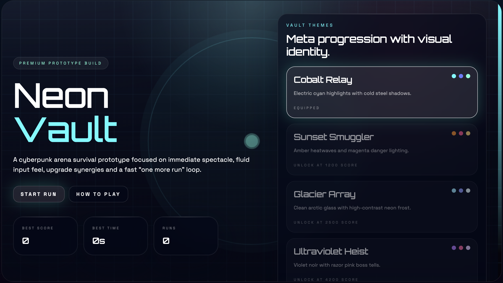

# Neon Vault

Neon Vault is a stylish browser-based cyberpunk arena survival game built with React, TypeScript, Phaser and Vite.

It focuses on fast movement, strong game feel, clean UI and short replayable runs.

## Screenshot



## Features

- Top-down arena survival gameplay
- Dash and nova ability
- Mouse aiming with responsive movement
- 3 enemy types plus boss encounter
- XP, levels and upgrade choices
- Best score and unlockable themes via `localStorage`
- React UI layered over Phaser gameplay

## Stack

- TypeScript
- React
- Phaser 3
- Vite
- Tailwind CSS
- Framer Motion

## Start

```bash
npm install
npm run dev
```

## Scripts

- `npm run dev` start local dev server
- `npm run check` run TypeScript check
- `npm run build` create production build
- `npm run preview` preview production build

## Controls

- `WASD` move
- `Shift` or `Right Click` dash
- `Left Click` or `Space` nova ability
- `Esc` pause

## Roadmap

- audio and music
- more bosses and enemy variants
- more weapons and build paths
- permanent progression
- leaderboard or daily challenge

## License

MIT
